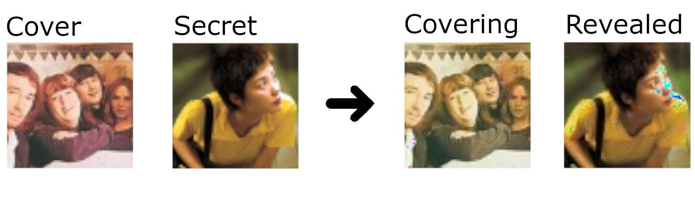
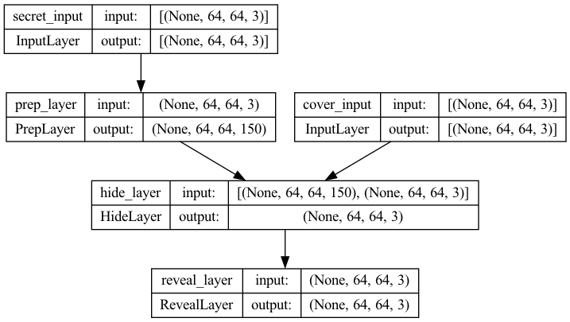

# Deep Steganography 

This is an implemention of the Deep Steganography model presented by Baluja, S. (2017). With this model it is possible to hide secret images within cover images, making it impossible to be deciphered by the naked eye.

Model was trained using a subset of the Tiny ImageNet database in order to fasten the training process.

## Example

(Yeah, this implementation sure has room for improvement. In the future I may train with larger images, train on a larger subset, vary the learning rates, experiment different batch sizes)

## Simplified model topology:

## References
Baluja, S. (2017). Hiding Images in Plain Sight: Deep Steganography. Neural Information Processing Systems. http://www.esprockets.com/papers/nips2017.pdf

mnmoustafa, M. A. (2017). Tiny ImageNet. Kaggle. https://kaggle.com/competitions/tiny-imagenet
